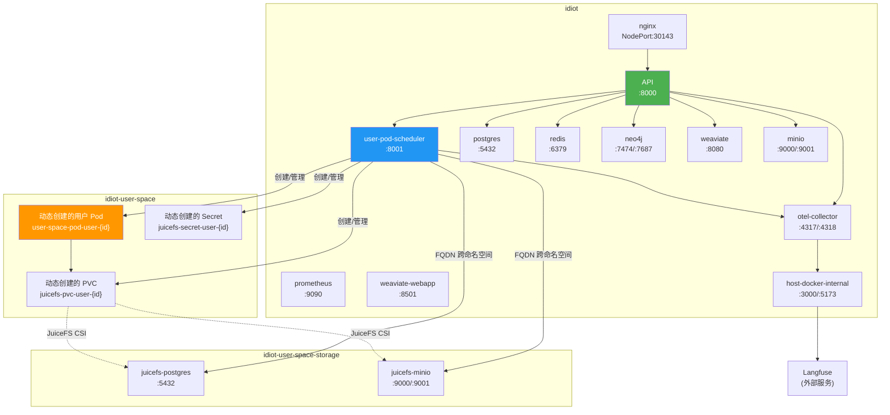
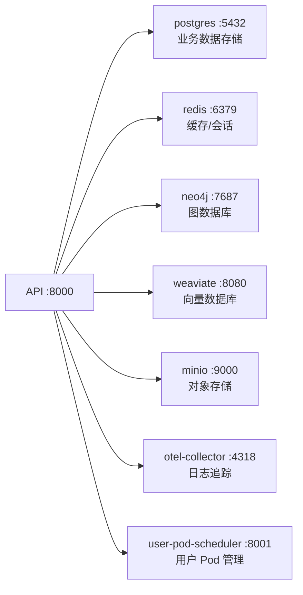
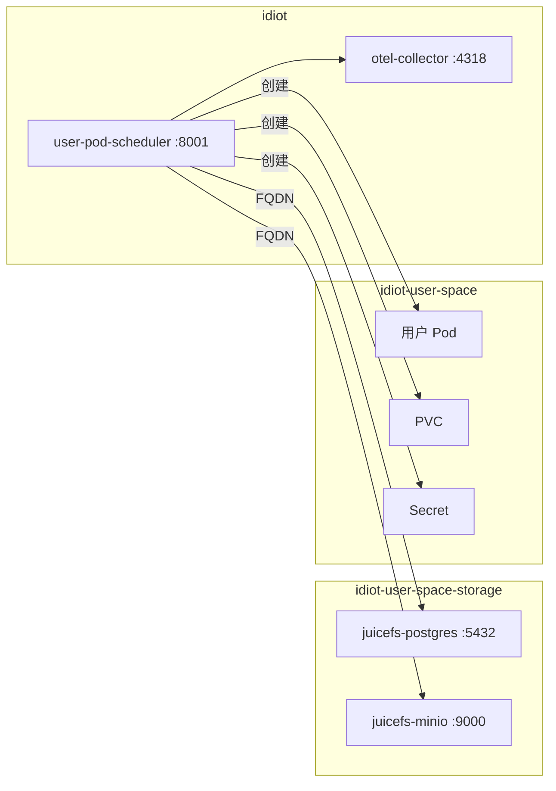
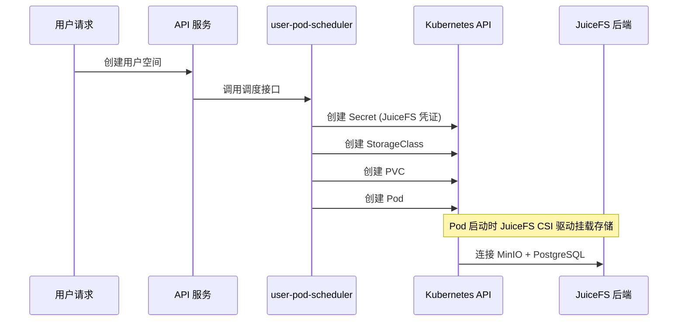
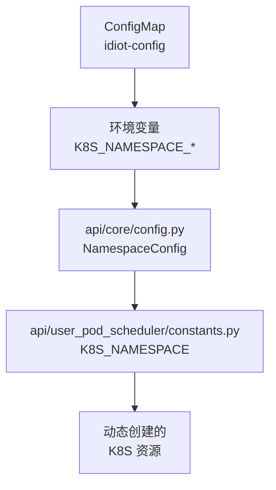
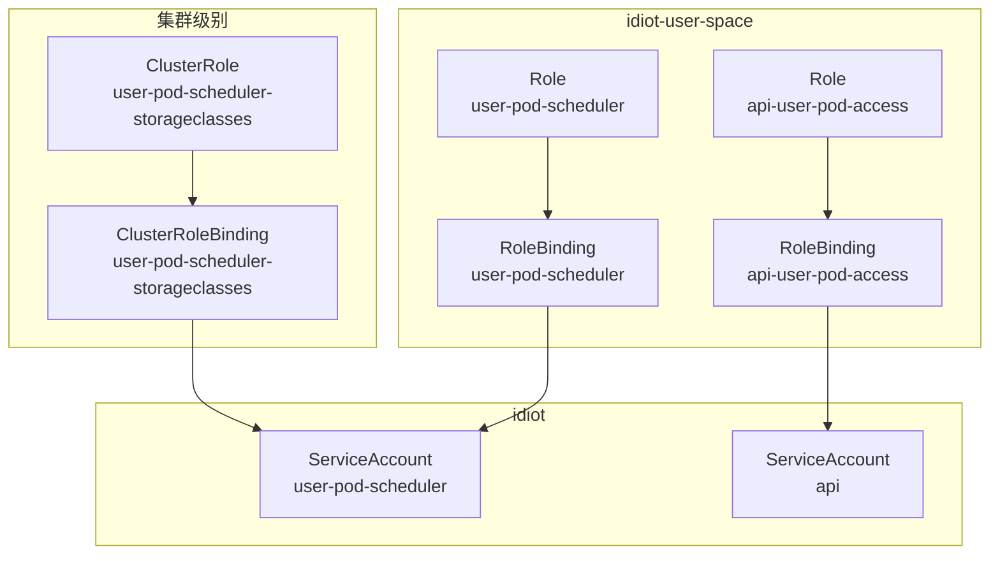

# IDIOT Kubernetes 部署架构文档

本文档描述 IDIOT 项目的 Kubernetes 部署架构、服务依赖关系和环境隔离策略。

## 命名空间架构

项目使用三个命名空间进行环境隔离：

| 命名空间 | 用途 | test 环境 |
|---------|------|----------|
| `idiot` | 主应用命名空间，包含核心服务 | `test-idiot` |
| `idiot-user-space` | 用户 Pod 运行命名空间 | `test-idiot-user-space` |
| `idiot-user-space-storage` | JuiceFS 存储后端命名空间 | `test-idiot-user-space-storage` |

## 服务依赖关系

### 服务拓扑图



### 服务分类

| 分类 | 服务 | 说明 |
|------|------|------|
| **应用服务** | API, user-pod-scheduler | 业务逻辑服务 |
| **数据存储** | postgres, redis, neo4j, weaviate, minio | 持久化存储服务 |
| **可观测性** | otel-collector, prometheus | 日志、追踪、监控 |
| **入口网关** | nginx | 对外暴露入口 |
| **辅助服务** | weaviate-webapp, host-docker-internal | Web UI、外部服务代理 |

## 服务调用详情

### API 服务依赖



### user-pod-scheduler 服务依赖



### 服务调用地址格式

| 调用类型 | 地址格式 | 示例 |
|---------|---------|------|
| 同命名空间 | `{service}:{port}` | `postgres:5432` |
| 跨命名空间 | `{service}.{namespace}.svc.cluster.local:{port}` | `juicefs-postgres.idiot-user-space-storage.svc.cluster.local:5432` |

## 动态资源创建

### 资源创建流程



### 动态创建的资源

| 资源类型 | 名称模式 | 命名空间 | 代码位置 |
|---------|---------|---------|---------|
| Secret | `juicefs-secret-user-{user_id}` | K8S_NAMESPACE_USER_SPACE | `k8s_resources.py` |
| StorageClass | `juicefs-storage-class-user-{user_id}` | 集群级别 | `k8s_resources.py` |
| PVC | `juicefs-pvc-user-{user_id}` | K8S_NAMESPACE_USER_SPACE | `k8s_resources.py` |
| Pod | `user-space-pod-user-{user_id}` | K8S_NAMESPACE_USER_SPACE | `k8s_resources.py` |

### 核心代码文件

| 文件路径 | 功能描述 |
|---------|---------|
| `api/user_pod_scheduler/k8s_resources.py` | 动态创建 Pod、PVC、Secret、StorageClass |
| `api/user_pod_scheduler/scheduler.py` | 调度逻辑入口 |
| `api/user_pod_scheduler/constants.py` | 命名空间配置常量 |
| `api/core/config.py` | 命名空间和服务端点配置 |

### 命名空间配置传递链



## RBAC 权限配置

### 权限模型



### 权限详情

#### user-pod-scheduler 服务账号

**ClusterRole** (集群级别)：
| 资源 | 权限 |
|------|------|
| `storageclasses` | get, list, watch, create, update, patch, delete |

**Role** (idiot-user-space 命名空间)：
| 资源 | 权限 |
|------|------|
| `pods`, `pods/status` | get, list, watch, create, update, patch, delete |
| `secrets` | get, list, watch, create, update, patch, delete |
| `persistentvolumeclaims`, `persistentvolumes` | get, list, watch, create, update, patch, delete |

#### api 服务账号

**Role** (idiot-user-space 命名空间)：
| 资源 | 权限 |
|------|------|
| `pods`, `pods/status` | get, list, watch |
| `pods/exec` | get, create |
| `pods/log` | get |

## 环境隔离配置

### Kustomize Overlay 结构

```
k8s/
├── base/                          # 基础配置
│   ├── kustomization.yaml
│   ├── 00-namespace.yaml
│   ├── 01-secrets.yaml
│   ├── 02-configmap.yaml
│   ├── 03-pvc.yaml
│   └── ...
└── overlays/
    └── test/                      # 测试环境 overlay
        └── kustomization.yaml     # patches 配置
```

### test 环境 Patches 清单

| 资源类型 | Patch 内容 |
|---------|-----------|
| Namespace | 添加 `test-` 前缀 |
| ConfigMap | 更新所有 `K8S_NAMESPACE_*` 变量 |
| PersistentVolume | 名称添加 `test-` 前缀，hostPath 指向 `volumes/test/` |
| PersistentVolumeClaim | `volumeName` 匹配新 PV 名称 |
| ClusterRole | 名称添加 `test-` 前缀 |
| ClusterRoleBinding | 名称和 `roleRef.name` 添加 `test-` 前缀 |
| RoleBinding | `subjects.namespace` 指向 test 命名空间 |
| NodePort | 端口号区分（test: 31xxx, base: 30xxx） |

### 构建命令

```bash
# 构建 base 环境
kubectl kustomize k8s/base

# 构建 test 环境
kubectl kustomize k8s/overlays/test

# 应用 test 环境
kubectl apply -k k8s/overlays/test
```

## 存储配置

### PersistentVolume 映射

| PV 名称 | 容量 | 用途 | hostPath |
|---------|------|------|----------|
| postgres-pv | 10Gi | 业务数据库 | `/k8s/volumes/postgres` |
| redis-pv | 5Gi | 缓存数据 | `/k8s/volumes/redis` |
| weaviate-pv | 10Gi | 向量数据 | `/k8s/volumes/weaviate` |
| minio-pv | 20Gi | 对象存储 | `/k8s/volumes/minio` |
| neo4j-pv | 10Gi | 图数据 | `/k8s/volumes/neo4j` |
| prometheus-pv | 10Gi | 监控数据 | `/k8s/volumes/prometheus` |
| api-pv | 10Gi | 应用数据 | `/k8s/volumes/api` |
| juicefs-minio-pv | 20Gi | JuiceFS 对象存储 | `/k8s/volumes/juicefs-minio` |
| juicefs-postgres-pv | 10Gi | JuiceFS 元数据 | `/k8s/volumes/juicefs-postgres` |

**注意**：PV 是集群级别资源，不受命名空间限制。多环境部署时需要：
1. 使用不同的 PV 名称（如添加环境前缀）
2. 使用不同的 hostPath 路径

## 配置文件

### 共享配置文件（所有环境）

| 文件路径 | 用途 |
|---------|------|
| `k8s/configs/nginx-default.conf` | Nginx 反向代理配置 |
| `k8s/configs/otel-collector-config-connector.yml` | OpenTelemetry Collector 配置 |
| `k8s/configs/prometheus-config.yaml` | Prometheus 监控配置 |

### 环境特定配置

| 配置项 | 来源 | 说明 |
|-------|------|------|
| 数据库连接 | Secret `idiot-secrets` | 敏感信息 |
| API Keys | Secret `idiot-secrets` | 第三方服务密钥 |
| 命名空间配置 | ConfigMap `idiot-config` | K8S 资源命名空间 |

## 注意事项

### 添加新服务

1. 在 `k8s/base/` 添加 YAML 定义
2. 如果服务需要跨命名空间调用，使用 FQDN 格式
3. 如果服务需要创建 K8S 资源，配置相应的 RBAC
4. 更新 `k8s/overlays/test/kustomization.yaml` 添加必要的 patches

### 添加新环境

1. 创建 `k8s/overlays/{env}/` 目录
2. 创建 `kustomization.yaml`，参考 test 环境
3. 添加必要的 patches（命名空间、PV、NodePort 等）
4. 创建对应的存储目录